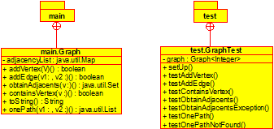

# BÚSQUEDA DE UN CAMINO EN UN GRAFO

## Breve descripción de la aplicación

* Resumen: Este proyecto implementa una estructura de datos de grafo en Java, con funciones para agregar vértices, arcos, obtener vértices adyacentes,
comprobar la existencia de un vértice y encontrar un camino en dos vértices

* Versión: 1.0.


## USO DEL PROGRAMA
 Limpiar
 
 ```console
mvn clean
```
 Compilar
```console
make compile
```
Javadoc

```console
mvn javadoc: javadoc
```
Ejecutar Programa

```console
mvn test
```

## Estructura del código

Tal y como muestra la siguiente figura




Existen dos clases: `Graph.java`, en el paquete `main`, que
contiene el método que realiza la simulación; y `GraphTest.java`, en el
paquete `test`, que  comprueba que el método ‘onePath(V v1, V v2)‘ encuentra un camino entre los vertices cuando existe.

## Licencia

Este proyecto está bajo la licencia de: 

Copyright 2023 Victor Martínez, Juan Maria García y Jacobo Fernández

   Licensed under the Apache License, Version 2.0 (the "License");
   you may not use this file except in compliance with the License.
   You may obtain a copy of the License at

http://www.apache.org/licenses/LICENSE-2.0

Unless required by applicable law or agreed to in writing, software
distributed under the License is distributed on an "AS IS" BASIS,
WITHOUT WARRANTIES OR CONDITIONS OF ANY KIND, either express or implied.
See the License for the specific language governing permissions and
limitations under the License.


